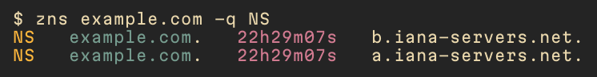
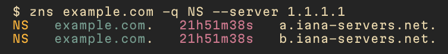
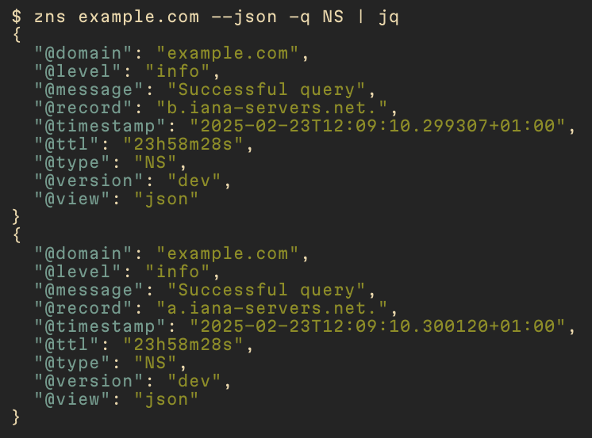

# zns

zns is a command-line utility for querying DNS records, displaying them in a human-readable, colored format that includes type, name, TTL, and value.

## Features

* Supports various DNS record types
* Colorized and tabular output for easy reading
* Concurrent queries for improved performance
* JSON output format for machine-readable results
* Option to write output to a file
* Option to query a specific DNS server

## Installing

```sh
brew install znscli/tap/zns
```

## Usage


### Query a specific record type



### Use a specific DNS server



### JSON output



### Writing to a file


## Contributing

Contributions are highly appreciated and always welcome.
Have a look through existing [Issues](https://github.com/znscli/zns/issues) and [Pull Requests](https://github.com/znscli/zns/pulls) that you could help with.

## License

This project is licensed under the MIT License. You are free to use, modify, and distribute the software, provided that you include the original license in any copies of the software. See the [LICENSE](LICENSE) file for more details.

